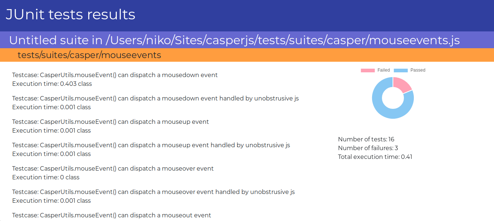

# JAngunit
This project was generated with [Angular CLI](https://github.com/angular/angular-cli) version 8.3.17.

It was developed and tested only in `Elementary OS 5.0 Juno`.

## Goal
### App
This webapp takes a JUnit XML results file and expose it in a visual way. It has a main page where all the testsuites are displayed and then a detailed view of each of them.

### Personal motif
I've started this small project as a way to learn:
1. The basics of web development.
2. Particularly how this framework (Angular) works.
3. To improve my coding skills and open it up to new things.

## Prerequisites

### Option 1: Install using your own machine

#### Node Package Manager (NPM) and Angular
First of all you will need Angular installed in your system. Install `NPM` first to reach this:
```
curl -sL https://deb.nodesource.com/setup_12.x | sudo -E bash - sudo apt-get install -y nodejs
sudo npm install npm@latest -g
npm install -g @angular/cli
```

#### Dependencies
Clone the repo in your system and install the packages included in `packages.json` before running the app by using `NPM`.
```
cd jAngunit; npm install
```

#### Run the server
Once you're inside the project directory, run:
```
npm start
```
You can access the the app in any browser by accessing URL _http://localhost:4270/_.

### Option 2: Use Docker
If you don't have Docker installed on your system, check out [this repo of mine](https://github.com/aorestr/dockerizing-jAngunit).
#### Build and run the app in dev mode
Once you are located on the repo folder, build the Docker image:
```
docker build -t angular-app:dev -f Dockerfile .
```
And then run a container based on it:
```
docker run --rm -ti -v ${PWD}:/app -v /app/node_modules -p 4270:4270 --name angular-container angular-app:dev
```
You can access the Angular app just by typing "http://localhost:4270/" on your favourite browser. Any change you make on the code will be taken by the container and make it available on the browser.

## Results
The following pictures are taken directly from the app:




## Acknowledgements
I must thank [@jlram](https://github.com/jlram) for helping me out with all the styling in the app.